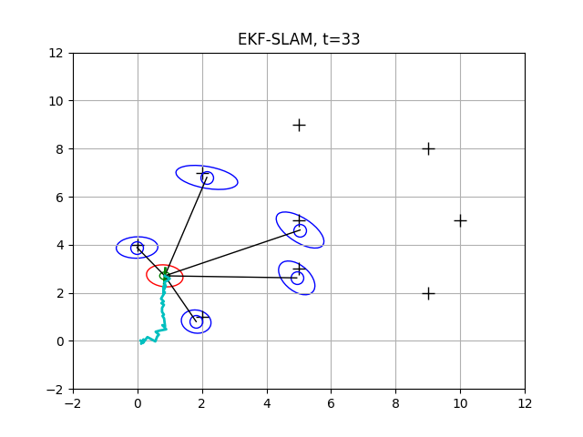
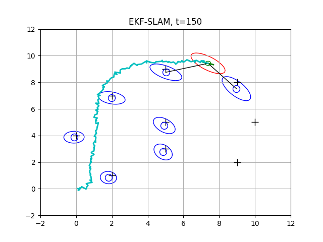
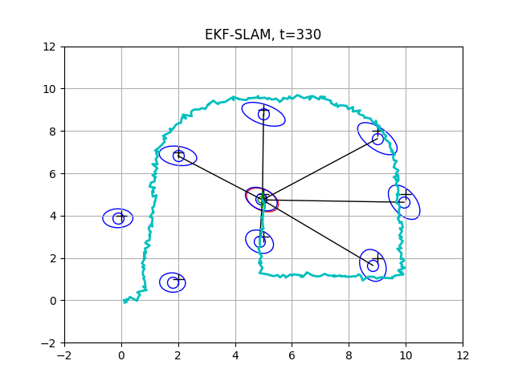

# Robot-Mapping
Python solutions to "[Robot Mapping](http://ais.informatik.uni-freiburg.de/teaching/ws13/mapping/)" course by "[Cyrill Stachniss](https://www.ipb.uni-bonn.de/)".

## Extended Kalman Filter Solution to SLAM Problem (solution to sheet-4)

